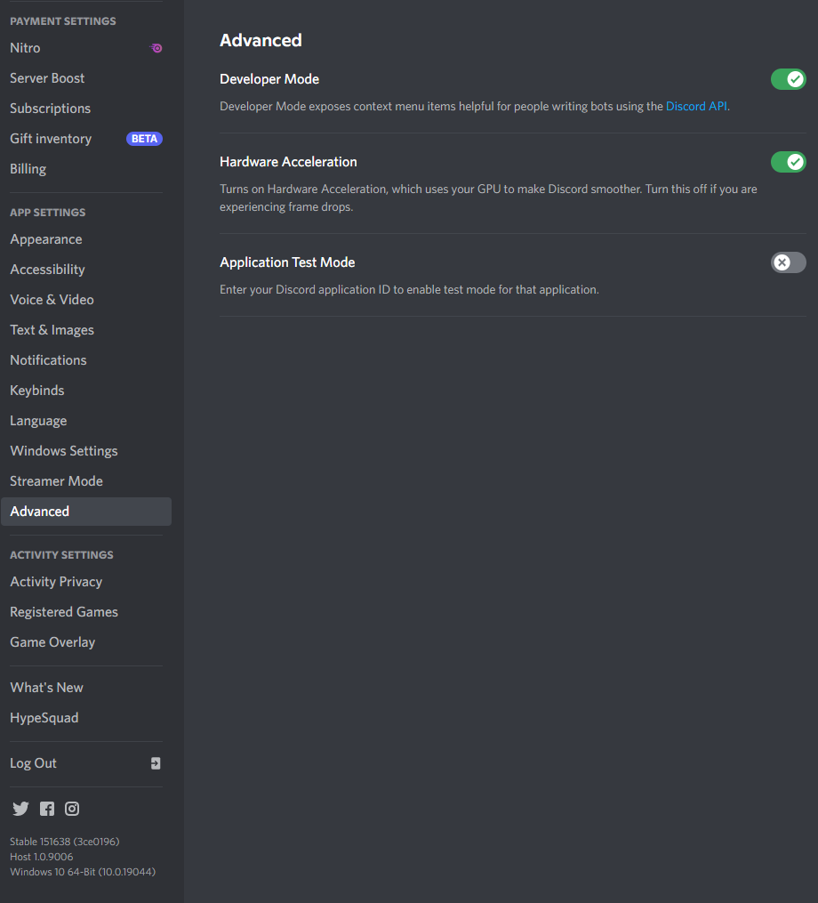
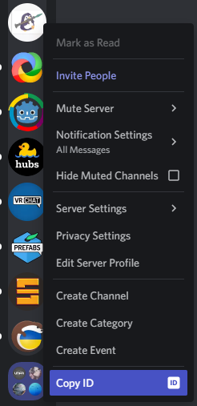

# About

This is the first version of my bot named "DeguDiffusion", which allows you
to run a Discord bot, accepting generation requests and sending them to
a HuggingFace StableDiffusion worker, working on the same machine.


The bot has a Job Queue system, allowing you to queue generations
requests and treat them once previous ones finished.

Each batch generates a specific thread, unless its size is lower than
a certain amount (<= 4 by default), in which cases messages are send
directly on the same channel.


This bot won't receive updates, I'm just uploading this version since it's
working, and want to keep the working version somewhere before I break it
and remake a more versatile one.

# Provided commands

## DeguDiffusion

`/degudiffusion`
Summons a form, where you can setup the generation


## Repeat Diffusion

Right-click on a Bot message > Apps > Repeat Diffusion

Summons a form, reusing the settings provided in the message.  
Fails if the message right-clicked contained no diffusion information.


## Check Degu PNG Metadata

Right-click on a generated image message > Apps > Check Degu PNG Metadata

Sends back the metadata of a generated PNG, if it still exist on the server.


> Note : This doesn't try to download the PNG !  
> This ony read it if the server already has it.
>
> Also, this generates ephemeral messages ("Only you can see this message" messages).  
> When sent inside threads, these messages cannot be seen by the client.  
> In this case, just try again.

# Special tags

* `{random_artists}`  
Adds 1 to 5 random artists names
* `{random_tags}`  
Adds 0 to 4 random tags
* `{lyuma_cheatcodes}`  
Try it !

You can add more by editing [replacers.json](replacers.json)

# Running the bot

This is mainly designed to run on a simple PC.

You need to be familiar with Python and the installation of
Python libraries.  
There is not autosetup through conda or anything here.

Requirements are :

* Discord.py  
`pip install discord.py`

* HuggingFace StableDiffusion  
See https://huggingface.co/blog/stable_diffusion  
At least : `pip install diffusers==0.4.0 transformers scipy ftfy`

Of course, feel free to adapt this to any *Diffusion you want, by editing
[**sdworker.py**](./sdworker.py).

## Testing SD alone

If you want to test SD itself alone, run `sdworker.py` directly :

`python sdworker.py`

> If you want to run it in FP16, just run it like this :  
> `python sdworker.py fp16`

This should output 8 images using the following prompt, in the same folder :  
**Degu enjoys its morning coffee by {random_artists}, {random_tags}**

If that doesn't work, check the `STABLEDIFFUSION_TOKEN` you put in the `.env` file.  
Also pay attention to every error output on the terminal, some of them might
provide clear explanations about what's going on.

See **Configuration** below for how to setup the `.env` file.

## Bots, how do they work ?

A bot is just a special headless Discord client operating with a specific "Bot"
account.

The `DISCORD_TOKEN` is used by the Bot to actually login to Discord.

Bot can run on your machine, and actually this one is actually only tested
in that kind of environment.

### Creating a bot

* Go to the [Discord Developer portal](https://discord.com/developers/applications).
* Create a "New application", by clicking the upper right button near your Profile icon.
* Setup the name.
* In Bot (Left panel), in "Build-A-Bot", click on "Add Bot" and Confirm.
* On Oauth2 General (Left panel), select :
  * **AUTHORIZATION METHOD**  
  In-app Authorization
  * **SCOPES**
    * `bot`
    * `application.commands`
  * **BOT PERMISSIONS**
    * Read Messages / View Channels
    * Send Messages
    * Create Public Threads
    * Send Messages in Threads
    * Attach Files
 * On OAuth2 URL Generator (Left panel) : 
   * Select the same **SCOPES** (`bot` and `application.commands`) and **PERMISSIONS**.
   * Copy the generated URL at the bottom.
* Enter this URL in your browser to add the generated bot to one of your server.  
> You can also send this link to people who'd like to invite the bot to their server.
* In Bot, again, click on 'Reset Token' and save it as `DISCORD_TOKEN` in the `.env` file.

> If the permissions were wrong :  
>   Set the permissions again on both panels  
>   Open the new URL in your browser and invite the Bot again on the same server.

## Configuration

To configure the bot, create a .env file with the following variables :

```env
DISCORD_TOKEN=YourDiscordBotToken
DISCORD_GUILD_ID=TheIDOfTheGuildYouWantYourBotIn
STABLEDIFFUSION_TOKEN=YourHuggingFaceToken
```

You can also copy the commented `.env.sample` to `.env` and edit it.

## How do I get these information ?

### Discord Bot Token

If you don't know it, click on "Reset Token" in the "Bot" section of your
application.
You can view your application settings on the [Discord Developer Portal](https://discord.com/developers/applications).


Once generated, copy the token as `DISCORD_TOKEN` in the `.env` file.

### Discord Guild ID

Note : Guild means Server

When using the Discord application, open the 'User Settings' panel (Gear icon at the right of your nickname, at the bottom left of the window), then go to "**App Settings** Advanced" and enable "Developer Mode".



Now, right click on the icon of the server you want to get the "Guild ID" from and select "Copy ID".



Then copy it as `DISCORD_GUILD_ID` in the `.env` file.

### Huggingface Token

You need to be registered on HuggingFaces.

Then go to "Access Token" from your User Profile and generate or copy your token
in the `.env` file as `STABLEDIFFUSION_TOKEN`.


Also, note that you also need to accept the licence of StableDiffusion here :  
https://huggingface.co/CompVis/stable-diffusion-v1-4


# Special notes

If you're not too familiar with StableDiffusion, remember that this
will eat your VRAM for breakfast.

Add `STABLEDIFFUSION_MODE=fp16` to your `.env` if you want to run in
FP16 mode, reducing the amount of VRAM used.  
While this can reduce the amount of VRAM used by 1.5 ~ 2 times,
remember that it's still GPU intensive and VRAM heavy.