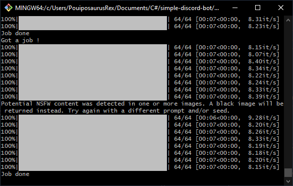
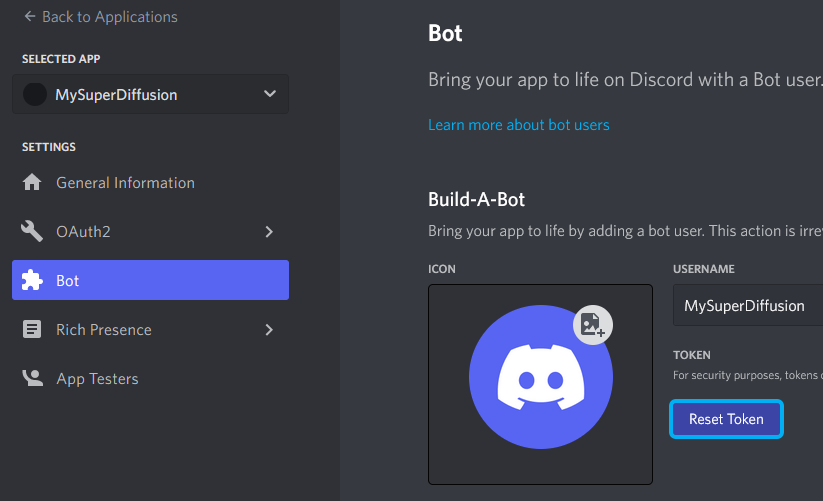

# TOC <!-- omit in toc -->

- [About](#about)
- [Provided commands](#provided-commands)
  - [DeguDiffusion](#degudiffusion)
  - [Repeat Diffusion](#repeat-diffusion)
  - [Check Degu PNG Metadata](#check-degu-png-metadata)
- [Running the bot](#running-the-bot)
  - [Requirements](#requirements)
  - [Running](#running)
    - [On Windows](#on-windows)
    - [On other platforms](#on-other-platforms)
      - [Install the dependencies](#install-the-dependencies)
      - [Run the bot](#run-the-bot)
  - [Testing SD alone](#testing-sd-alone)
  - [How do I get the required informations ?](#how-do-i-get-the-required-informations-)
    - [Huggingface Token](#huggingface-token)
    - [Discord Bots, how do they work ?](#discord-bots-how-do-they-work-)
      - [Creating a bot and bot account](#creating-a-bot-and-bot-account)
        - [Screenshots of the authorizations](#screenshots-of-the-authorizations)
          - [Oauth2 General](#oauth2-general)
          - [Bot intentions](#bot-intentions)
          - [Oauth2 URL Generator](#oauth2-url-generator)
      - [Discord Bot Token](#discord-bot-token)
- [Additional configuration](#additional-configuration)
  - [Special tags](#special-tags)
  - [Denying prompts](#denying-prompts)
    - [Examples](#examples)
    - [Example 1](#example-1)
    - [Example 2](#example-2)
    - [Technical notes](#technical-notes)
  - [Compact mode](#compact-mode)
- [Special notes](#special-notes)
- [Known bugs](#known-bugs)

# About

This is the code of the first version of my Discord bot software named "DeguDiffusion",
that allows you to run your own self-hosted AI images generation Discord bot
using a local StableDiffusion installation.

The software is available under MIT license.

The concept behind it is simple :

* You create a bot account, and add its token to the `.env` file as `DISCORD_TOKEN`.
* The software will use the bot account to connect to Discord and register image
  generation commands (`/degudiffusion` notably) on the servers it has been invited
  to.
* Users on the servers use these commands to send image generation requests to your server.
* Your server generate the images, using a local installation of
  [HuggingFaces StableDiffusion](https://huggingface.co/CompVis/stable-diffusion-v1-4),
  and send back the result through Discord.


The software is meant to run on a machine equipped with an NVIDIA GPU.  
This has not been tested at all with AMD or Intel GPU.

A Job Queue system is provided, allowing you to queue generations
requests and treat them once previous ones finished.

Each request job generates a specific thread, unless its size is lower than
a certain amount, in which cases messages are sent directly on the same channel.


This bot won't receive major updates, I'm just uploading this version since it's
working, and want to keep the working version somewhere before I break it
and remake a more versatile one.



# Provided commands

## DeguDiffusion

`/degudiffusion`
Summons a form, where you can setup the generation


## Repeat Diffusion

Right-click on a Bot message > Apps > Repeat Diffusion

Summons a form, reusing the settings provided in the message.  
Fails if the message right-clicked contained no diffusion information.


## Check Degu PNG Metadata

Right-click on a generated image message > Apps > Check Degu PNG Metadata

Sends back the metadata of a generated PNG, if it still exist on the server.


> Note : This doesn't try to download the PNG !  
> This ony read it if the server already has it.
>
> Also, this generates ephemeral messages ("Only you can see this message" messages).  
> Sometimes these messages cannot be seen by the client, when sent inside
> threads.  
> In this case, just try again.

# Running the bot

This is mainly designed to run on a simple Windows PC.  
I haven't tested it on Linux yet.

Execute `STARTBOT.bat` or `STARTBOT.sh`.

## Requirements

* Python 3 (Tested with Python 3.10)
* A NVIDIA Graphics Card (CUDA)
* A [Discord bot account](https://discord.com/developers/applications) for a `DISCORD_TOKEN`
* A [HuggingFaces account](https://huggingface.co/) for a `HUGGINGFACES_TOKEN`

## Running

> If you're using Docker, check https://hub.docker.com/r/vrvoyage/degudiffusion

Setup a `.env` file with at least two entries :

```env
# Make sure your bot has sufficient rights and privileges.
# Write your Discord bot token after the '='. No quotes needed.
DISCORD_TOKEN=

# Make sure you accepted the license on
# https://huggingface.co/CompVis/stable-diffusion-v1-4
# Write your Huggingfaces token after the '='. No quotes needed.
HUGGINGFACES_TOKEN=
```

> Check `.env.sample` for more configuration directives.  
> Read below if you want to know how to get these tokens.

Then

### On Windows

Double-click on **STARTBOT.bat** and wait for "StableDiffusion ready to go".

### On other platforms

#### Install the dependencies

```bash
pip install -r requirements.txt
```

#### Run the bot

```bash
./STARTBOT.sh # or python3 degu_diffusion_v0.py
```

## Testing SD alone

If you want to test SD itself alone, run `test_stablediffusion_alone.bat` or
`test_stablediffusion_alone.sh`.

Using default settings, this should output 8 images in the output
folder (`generated/` by default).  
The prompt used during the tests is :  
**Degu enjoys its morning coffee by {random_artists}, {random_tags}**

If the test fails, check the `HUGGINGFACES_TOKEN` you put in the `.env` file.  
Also pay attention to every line output on the terminal, some of them might
provide clear explanations about what's going on.

See **Configuration** below for how to setup the `.env` file.

## How do I get the required informations ?

### Huggingface Token

You need to be registered on HuggingFaces.

Then go to "Access Token" from your User Profile and generate or copy your token
in the `.env` file as `HUGGINGFACES_TOKEN`.


**You also need to accept the licence of StableDiffusion here :  
https://huggingface.co/CompVis/stable-diffusion-v1-4 **

### Discord Bots, how do they work ?

A bot is just a headless Discord client operating with a special "Bot"
account, who needs a TOKEN to login to Discord, instead of a login/password.

So, the `DISCORD_TOKEN` is used by the Bot to actually login to Discord.

You can run a bot, along with your usual account, on the same machine, and the
bot was actually only tested in that kind of environment.

#### Creating a bot and bot account

* Go to the [Discord Developer portal](https://discord.com/developers/applications).
* Create a "New application", by clicking the upper right button near your Profile icon.
* Setup the name then make sure you're currently editing your new application.
* In Bot (Left panel), in "Build-A-Bot", click on "Add Bot" and Confirm.
* On Oauth2 General (Left panel), select :
  * **AUTHORIZATION METHOD**  
  In-app Authorization
  * **SCOPES**
    * `bot`
    * `application.commands`
  * **BOT PERMISSIONS**
    * Read Messages / View Channels
    * Send Messages
    * Create Public Threads
    * Send Messages in Threads
    * Attach Files
 * On OAuth2 URL Generator (Left panel) : 
   * Select the same **SCOPES** (`bot` and `application.commands`) and **PERMISSIONS**.
   * Copy the generated URL at the bottom.
* Enter this URL in your browser to add the generated bot to one of your server.  
> You can also send this link to people who'd like to invite the bot to their server.
* In Bot, again, click on 'Reset Token' and save it as `DISCORD_TOKEN` in the `.env` file.

> If the permissions were wrong :  
>   Set the permissions again on both panels  
>   Open the new URL in your browser and invite the Bot again on the same server.

##### Screenshots of the authorizations

###### Oauth2 General


###### Bot intentions


###### Oauth2 URL Generator


#### Discord Bot Token

If you don't know it, click on "Reset Token" in the "Bot" section of your
application.
You can view your application settings on the [Discord Developer Portal](https://discord.com/developers/applications).



Once generated, copy the token as `DISCORD_TOKEN` in the `.env` file.

# Additional configuration

Here's the list of **optional** environment variables you
can define to configure the bot.  
When not defined, their **Default** value will be used.

* `IMAGES_OUTPUT_DIRECTORY`  
  Define where you want to store the generated pictures.  
  **Default** : `generated`  
  Spaces are allowed. No need to use quotes.  
  The directory will be created if it doesn't exist.  
  Example : `IMAGES_OUTPUT_DIRECTORY=another folder`  
  > When running the bot, this setting is ignored when
  > `SAVE_IMAGES_TO_DISK` is set to `false`.

* `SAVE_IMAGES_TO_DISK`  
  Define whether generated files are saved on the disk or not.  
  **Default** : `true`  
  Example : `SAVE_IMAGES_TO_DISK=false`  
  > This setting is ignored when testing Stable Diffusion alone.

* `STABLEDIFFUSION_MODE`  
  Allows you to select between different StableDiffusion modes.  
  **Default** : `fp32`  
  Currently only fp16 and fp32 are supported.  
  VRAM usage is lower in fp16, so if you're low on VRAM,
  set this to `fp16`.  
  Example : `STABLEDIFFUSION_MODE=fp16`

* `MAX_IMAGES_PER_JOB`  
  Maximum number of images to output per job request.  
  **Default** : `64`  
  That means that the **NUMBER OF IMAGES** typed in `/degudiffusion`
  form will be clamped to that maximum value.  
  Example : `MAX_IMAGES_PER_JOB=8`

* `MAX_INFERENCES_PER_IMAGE`  
  Maximum number of inferences steps per image.  
  **Default** : `120`  
  This clamps the **INFERENCES** number typed in `/degudiffusion`
  form to that maximum value.  
  Example : `MAX_INFERENCES_PER_IMAGE=30`

* `MAX_GUIDANCE_SCALE_PER_IMAGE`  
  Maximal guidance scale allowed.  
  **Default** : `20`  
  This clamps the **GUIDANCE SCALE** number typed in `/degudiffusion`
  form will be clamped to that maximum value.  
  Example : `MAX_GUIDANCE_SCALE_PER_IMAGE=7.5`

* `IMAGES_WIDTH` and `IMAGES_HEIGHT`  
  The width and height of generated images.  
  **Default** : `512`  
  Be ***EXTREMELY*** careful with this one, VRAM usage grows dramatically
  when using higher values.  
  I highly recommend to switch to fp16 when using more than 512x512.  
  Going below 512 in any direction will generally lead to garbage results.  
  Example :  
  `IMAGES_WIDTH=768`  
  `IMAGES_HEIGHT=768`

* `MAX_IMAGES_BEFORE_THREAD`  
  The number of images after which the bot will automatically create a thread.  
  **Default** : `2`  
  That means that if you set it to 5 :  
  When requesting up to 5 images per job, the bot will output everything
  on the channel from where the job request was done.  
  When requesting 6 images or more, the bot will create a thread and
  send the results inside this thread.  
  Example : `MAX_IMAGES_BEFORE_THREAD=5`

* `COMPACT_RESPONSES`  
  When set to `True` or `true`, the job response will only include the pictures,
  without any further details (like the Seed, Actual Prompt.).  
  **Default** : `false`  
  Example : `COMPACT_RESPONSES=True`  
  > You can still use "Check Degu PNG Metadata" when using compact responses.

* `DEFAULT_IMAGES_PER_JOB`  
  The default **NUMBER OF IMAGES** used in `/degudiffusion` form.  
  **Default** : `8`  
  Example : `DEFAULT_IMAGES_PER_JOB=3`

* `DEFAULT_PROMPT`  
  The default **PROMPT** used in `/degudiffusion` form.  
  **Default** : `Degu enjoys its morning coffee by {random_artists}, {random_tags}`  
  Example : `DEFAULT_PROMPT=A Nendoroid of a Chipmunk by {random_artists}, {lyuma_cheatcodes}`

* `DEFAULT_SEED`  
  The default **SEED** used in `/degudiffusion` form.  
  **Default** to an empty value.  
  Note that you don't have to type a SEED value, in Degu Diffusion.  
  When no seed is provided, a random seed is generated for you.  
  Example : `DEFAULT_SEED=-1`

* `DEFAULT_INFERENCES_STEPS`  
  The default number of **INFERENCES** used in `/degudiffusion` form.  
  **Default** : `60`  
  Example : `DEFAULT_INFERENCES_STEPS=30`

* `DEFAULT_GUIDANCE_SCALE`  
  The default **GUIDANCE SCALE** used in `/degudiffusion` form.  
  **Default** : `7.5`  
  Example : `DEFAULT_GUIDANCE_SCALE=15`

* `SEED_MINUS_ONE_IS_RANDOM`  
  Determine if -1 should be interpreted as a random seed or an actual seed value.  
  **Default** : True  
  By default, now, `-1` is treated as a random value, since many users
  are used to type `-1` to get a random seed.  
  Note that you don't have to type a SEED value, in Degu Diffusion.  
  When no seed is provided, a random seed is generated for you.  
  Example : `SEED_MINUS_ONE_IS_RANDOM=false`

* `STABLEDIFFUSION_LOCAL_ONLY`  
  Force `StableDiffusionPipeline` to use predownloaded local files only, and avoid
  connecting to the internet.  
  **Default** : `false`  
  Example : `STABLEDIFFUSION_LOCAL_ONLY=true`  
  > When set to true, `HUGGINGFACES_TOKEN` is not required anymore.

* `STABLEDIFFUSION_CACHE_DIR`  
  Determine where `StableDiffusionPipeline` download its files to.  
  **Empty by Default**  
  This is mainly used for Docker setups.  
  When not set, or set to an empty string, `StableDiffusionPipeline` will
  determine where to download its files.  
  Example : `STABLEDIFFUSION_CACHE_DIR=sd_cache`  
  > The directory will be created if it doesn't exist.

* `STABLEDIFFUSION_MODEL_NAME`  
  Determine the HuggingFaces model used by `StableDiffusionPipeline`.  
  **Default** : `CompVis/stable-diffusion-v1-4`
  > Do not change this unless you really know what you are doing.

* `TORCH_DEVICE`  
  Determine the PyTorch device used. Default to "cuda".  
  **Default** : `cuda`  
  Any value other that `cuda` is untested.  
  Example : `TORCH_DEVICE=rocm`

* `FORM_NUMBER_OF_IMAGES_INPUT_MAX`  
  Maximum number of characters allowed for **NUMBER OF IMAGES** in
  /degudiffusion form.  
  **Default** : `4`  
  Example : `FORM_NUMBER_OF_IMAGES_INPUT_MAX=3`

* `FORM_PROMPT_INPUT_MAX`  
  Maximum number of characters allowed for **PROMPT** in
  /degudiffusion form.  
  **Default** : `500`  
  Example : `FORM_PROMPT_INPUT_MAX=100`  
  > Note that with the default setup, StableDiffusion will
  > parse up to 77 tokens and ignore the rest.  

* `FORM_SEED_INPUT_MAX`  
  Maximum number of characters allowed for **SEED** in
  /degudiffusion form.  
  **Default** : `38`  
  Example : `FORM_SEED_INPUT_MAX=200`

* `FORM_INFERENCES_INPUT_MAX`
  Maximum number of characters allowed for **INFERENCES** in
  /degudiffusion form.  
  **Default** : `3`  
  Example : `FORM_INFERENCES_INPUT_MAX=2`

* `FORM_GUIDANCE_SCALE_INPUT_MAX`  
  Maximum number of characters allowed for GUIDANCE SCALE in
  /degudiffusion form.  
  **Default** : `6`  
  Example : `FORM_GUIDANCE_SCALE_INPUT_MAX=3`  
  > Be careful, conversion from float to string adds at least one decimal.  
  This conversion might lead to errors when using the `DEFAULT_GUIDANCE_SCALE`,
  while preparing the form.  
  For example, if `DEFAULT_GUIDANCE_SCALE=7` then the displayed value
  will be `7.0`, and will take 3 characters.  
  If `FORM_GUIDANCE_SCALE_INPUT_MAX` is set to `2` characters, the form
  will become unuseable.  
  
## Special tags

* `{random_artists}`  
Adds 1 to 5 random artists names
* `{random_tags}`  
Adds 0 to 4 random tags
* `{lyuma_cheatcodes}`  
Try it !

You can add more by editing [replacers.json](replacers.json)

## Denying prompts

If the file **config/denied_expressions.txt** exists, each line of these files
is interpreted as a Regular Expression.  
When a user request an image generation, if the prompt matches any of these
regular expressions, the generation request is denied.

This file is **optional** and is not created by default.

There are various online tools to build Regular Expressions, like, for example,
https://regex101.com/ .

### Examples

In the following examples, "denied" means that the generation request
will be denied, if the mentionned word is present in the prompt.

### Example 1

Using the following **config/denied_expressions.txt**

```
Table
```

If the prompt contains the characters "table", the generation request
will be denied.

Meaning that the prompt :

* "Hamsters playing roulette around a **tABlE**" will be denied.  
* "Horses in their S**table**s" will be denied.


### Example 2

Using the following **config/denied_expressions.txt**

```
\bTable
Sofa\b
chair
```

Prompt will be denied if any of thees conditions is true :
* The prompt contains any word starting with "table"
* The prompt contains any word ending with "sofa"
* The prompt contains the characters "chair"

Meaning that the promt :
* "A pic-nic **table**" will be denied.
* "People playing **Table**top RPG" will be denied.
* "An Unstable portal" will be accepted.
* "A photo of a bed-**sofa**" will be denied.
* "A world Sofar" will be accepted.
* "Reunion of Arm**chair** general" will be denied.


### Technical notes

The regular expressions are compiled with the `re` Python
standard library, using only one flag : `re.IGNORECASE`.

## Compact mode

Here are two screenshots with :

* Compact mode disabled (default)  
  

* Compact mode enabled (`COMPACT_RESPONSES=True`)  
  

# Special notes

If you're not too familiar with StableDiffusion, remember that this
will eat your VRAM for breakfast.

Add `STABLEDIFFUSION_MODE=fp16` to your `.env` if you want to run in
FP16 mode, reducing the amount of VRAM used.  
While this can reduce the amount of VRAM used by 1.5 ~ 2 times,
remember that it's still GPU intensive and VRAM heavy.

# Known bugs

* The 'Job done' message is sent just before the last result, due to
timing issues.
